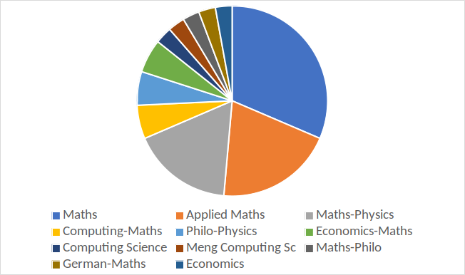
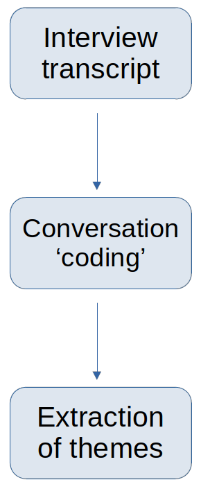
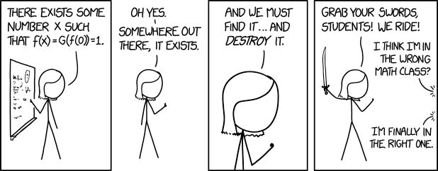

```{r setup, include = FALSE}
library(knitr)
library(tidyverse)
library(NHSRtheme)
# set default options
opts_chunk$set(echo = FALSE,
               fig.width = 7.252,
               fig.height = 4,
               dpi = 300)

# uncomment the following lines if you want to use the NHS-R theme colours by default
# scale_fill_continuous <- partial(scale_fill_nhs, discrete = FALSE)
# scale_fill_discrete <- partial(scale_fill_nhs, discrete = TRUE)
# scale_colour_continuous <- partial(scale_colour_nhs, discrete = FALSE)
# scale_colour_discrete <- partial(scale_colour_nhs, discrete = TRUE)
```

class: title-slide, left, bottom

# `r rmarkdown::metadata$title`
----
## **`r rmarkdown::metadata$subtitle`**
### `r rmarkdown::metadata$author`
### `r rmarkdown::metadata$date`

---

# Pedagogic Context

.pull-left[

.pink[**Transition to University**]

  - School/University culture differences
  - Personal and financial difficulties
  - Sense of belonging

.pink[**Transition to University mathematics**]

  - abstract and formal
  - proofs
  
.pink[**The Scottish case**]

  - transition felt at level 2
]
.pull-right[  
  ```{r proofs, echo = FALSE, fig.align='center', out.width='100%'}
knitr::include_graphics("proofs.png")
```
]

--

.center[**Retention and progression issues for some, possibly exacerbated by the COVID pandemic.**]
---
class: middle

# Pedagogic Context

.green[**Use of examples in mathematical education**]
  - Benefits of doing and creating examples and counter-examples.
  - Participate to the construction of _concept image_ associated with a _concept definition_.

--

.green[**Co-creation pedagogy**]
  - Including students in the design of the curriculum.
  - Student-centered pedagogic approach.


---

# Linear Algebra Course

.center[.green[**Could we use co-creation to help transition to level 2 mathematics courses?**]]

--

.pull-left[

- Two linear algebra courses in year 2 at UoA: 
  - 35 registered students on semester 1 course: 75% in Natural and Computing Science degrees
  - 31 of those also took the semester 2 course
  
]

.pull-right[

]

---

# Linear Algebra Course

- .green[Called for volunteers in semester 1 to work in January/February 2023 (between the 2 semesters) in small groups to:]
  - identify difficult linear algebra topics;
  - create tutorial style questions and problems on these topics;
  - code them in NUMBAS.
  
--

- .green[Intention was to collect feedback on experience of co-creation in groups:]
  - impact on motivation and confidence in linear algebra using questionnaires and interview;
  - impact on marks.
  
--

Due to PGCert timeline, the ethics application was only completed at the end of November 2022.
  
---

# Experiment

.pink[Only one student came forward ...]

.pull-left[
The project ran between 02 February and 15 March 2023.

We met weekly to monitor progress and ran a focused interview on 15 March.

Interview conversation is analysed using Interpretative Phenomenological Analysis (IPA):

**extracting themes and subthemes emerging from the interview which characterise the participant's experience**.
]

.pull-right[
```{r IPA, echo = FALSE, fig.align='center', out.width='30%', fig.cap='IPA process'}

```
]

---

# IPA Results

.left[

.pink[**They would have liked a group experience**]

 Knowledge exchange with peers;
 
 Feeling safe among other novices;
 
 Belonging to a community of learners.

]

--

.right[
.green[**It has changed how they see teaching and learning**]

 Revisiting difficulties and consolidating knowledge;
 
 Learning something unexpected (programming in NUMBAS!);
 
 Becoming a critical learner.
 
.green[**It has changed how they see themselves**]

 Self-confidence: they can do mathematics;
 
 Legitimacy: they are a legitimate student of mathematics;
 
 Well-being: they feel good about having raised the challenge.

] 

---

# Discussion

.left[

.green[**Benefits for _study skills_**]:
  
  improved motivation, focus, independence.

.green[**Benefits for _learning mathematics_**]:
  
  testing and consolidating mathematical knowledge and understanding through example creation.

.green[**Benefits for the _student resilience and legitimate participation_**]:
  
  feeling capable of doing mathematics, of being a legitimate student in mathematics and enjoying learning new and challenging concepts (**zone of proximal development**).

]

--

.right[

.pink[**How about group work?**]

  Could group co-creation of of mathematical examples  help develop a community of practice of new       learners in the community of mathematicians?

] 
---
class: middle

# Future Plans

(Project in collaboration with Dr JB Gramain, University of Aberdeen)

--

Integrate activities of creation of examples in groups in both Linear Algebra courses in 2023/24:

  - What makes a **good** mathematical exercise? `r fontawesome::fa("calculator")`
  - Build gradual activities towards creating own exercise in groups (possibly discipline specific) `r fontawesome::fa("people-group")`
  - Course competition and reward of range of efforts `r fontawesome::fa("award")`

--
  - Creation of exercise as assessment in second semester, graded against students' criteria `r fontawesome::fa("book-open-reader")`

--
  - Questionnaire & focus interview in view of collecting feedback `r fontawesome::fa("clipboard-question")`

---

class: middle, center



# Thanks for listening !

`r fontawesome::fa("face-smile")`

